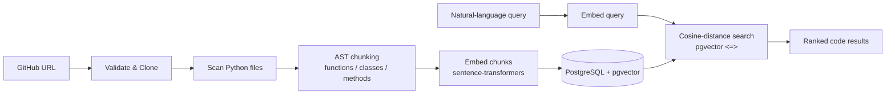

# RepoLens

RepoLens is a semantic code search engine that lets developers search public GitHub repositories using natural-language queries.


## Why

Traditional code search (grep, Ctrl+F) matches exact text. Search for "authentication" and you miss code that says "login" or "verify_credentials." RepoLens searches by **meaning** instead: a query for *"parse command line arguments"* against the [Click](https://github.com/pallets/click) library returns Click's `parse_args` method as the top result — even though that exact phrase never appears in the code.

## How it works

RepoLens splits into two jobs — indexing a repo, then searching it.



**Indexing:** clone the repo, walk it for Python files (pruning `.git/`, `venv/`, `node_modules/`, etc.), parse each file with Python's `ast` module into semantic chunks (one per function/class/method with metadata), embed each chunk with `all-MiniLM-L6-v2`, and store the 384-dimension vectors in PostgreSQL via pgvector.

**Searching:** embed the user's query with the same model, then use pgvector's cosine-distance operator (`<=>`) to find the nearest chunk vectors, ranked by similarity.

## Tech stack

- **Frontend:** React, TypeScript, Vite
- **Backend:** FastAPI, Python
- **Database:** PostgreSQL with the pgvector extension
- **Embeddings:** sentence-transformers (`all-MiniLM-L6-v2`, 384-dim)
- **Parsing:** Python `ast` module
- **Testing:** pytest

## Setup

### Prerequisites
- Python 3.10+
- Node.js 18+
- PostgreSQL with pgvector (`brew install postgresql pgvector` on macOS)

### Backend
```bash
cd backend
python -m venv venv
source venv/bin/activate
pip install -r requirements.txt

# Create the database and schema
createdb repolens
psql repolens < schema.sql

# Configure the connection
echo "DATABASE_URL=postgresql://localhost/repolens" > .env

# Run the API
uvicorn app.main:app --reload
```

### Frontend
```bash
cd frontend
npm install
npm run dev
```

Open `http://localhost:5173`, paste a public GitHub repo URL, index it, and search.

### Tests
```bash
cd backend
python -m pytest
```

## Design decisions

**Python-only via AST, with a clear path to more languages.** Semantic chunking requires understanding code structure, which is language-specific. RepoLens uses Python's built-in `ast` module to chunk cleanly by function/class/method. The scanner and chunker are isolated so the parser layer can later be swapped for [tree-sitter](https://tree-sitter.github.io/) to support other languages without touching cloning, storage, or search.

**Placeholder embeddings before real ones.** The full pipeline (chunk → store → search) was built and verified with deterministic fake vectors *before* introducing the embedding model, so the model was never a variable while debugging the pipeline. Swapping in the real model changed exactly one function.

**Injection safety at every boundary.** User input never becomes executable code: git is invoked with argument lists (never `shell=True`), and every SQL query uses parameterized placeholders (never string interpolation). Both apply the same principle — keep untrusted data separate from commands.

**Resilient indexing.** Each file is parsed inside its own error handler, so a single unparseable file (a Python 2 file, a broken fixture) is skipped and recorded rather than crashing the entire repo's indexing.

**Synchronous indexing for the MVP.** Indexing runs in-request with a loading state in the UI. For larger repos this would move to a background job queue (see Future work).

## Future work

- Background job queue for indexing large repos without blocking the request
- Multi-language support via tree-sitter
- HNSW index on the embedding column for faster search at scale
- Filtering of low-signal chunks (tiny declaration-only classes) to sharpen results

## License

MIT
